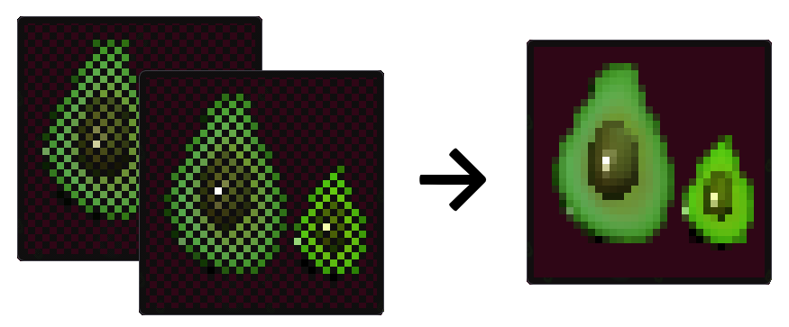

# Mosaiikki

An implementation of **Checkerboard Rendering** using [Magnum](https://magnum.graphics/) and OpenGL.



## Technique

Checkerboard rendering is a temporal upsampling technique that reduces shading work with minimal impact on visual quality. Expensive fragment shader operations are run at half-resolution and then combined with the previous frame's output in a resolve shader.

By always shading 2 MSAA samples and jittering the viewport by one pixel in every odd frame, we can combine the current frame's samples A and B with last frame's samples C and D to fill the full-res framebuffer:

```
even frame:   odd frame:    combined frame:
(current)     (previous)    (full-res)

+---+---+     +---+---+         +---+---+
|   | A |     |   | C |         | C | A |
+---+---+  +  +---+---+  =  +---+---+---+
| B |   |     | D |   |     | D | B |
+---+---+     +---+---+     +---+---+
 ```

While this is trivial for static scenes, complications arise with moving objects/cameras and (dis)occlusion. The resolve step needs to consider per-pixel velocity between frames and detect and handle fragments being occluded.

For a more thorough introduction, check out [Intel's white paper](https://software.intel.com/content/www/us/en/develop/articles/checkerboard-rendering-for-real-time-upscaling-on-intel-integrated-graphics.html).

## Overview

This implementation is loosely based on the Intel D3D11 forward shading example, while also introducing improvements from several other papers (see [References](#references)). Here's a rough overview of all the steps:

1. **Velocity pass**
    - Render full-res per-pixel screenspace velocity buffer
    - Only dynamic objects; for static objects camera reprojection is used in the reconstruction pass
2. **Jitter** camera viewport
    - Translate a full-res pixel to the right
    - Happens every second (= odd) frame
3. **Checkerboard pass**: Render scene at **quarter-res**
    - MSAA 2X framebuffer with fixed sample positions
    - Fragment shader is run on both samples
    - Reuses downsampled velocity pass depth to reduce overdraw
4. **Reconstruction pass**: Combine previous and current quarter-res
    - Fullscreen pass, one thread for each full-res fragment
    - See [Reconstruction shader](#Reconstruction-shader) for more details

## Implementation

### Reconstruction shader

The reconstruction shader is run for each full-res fragment. It performs the following steps:

1. Determine if the current fragment was shaded by this frame
    - This is true if this fragment falls on the current sample positions. Sample positions depend on the current camera jitter
    - If so, return the color and exit
2. Resolve the current color from last frame's output
    - Sample velocity buffer to calculate the current fragment's position in the previous frame
        - For static objects the velocity is instead calculated by reprojecting the current world space position through the previous camera matrices
    - Check if the previous fragment position **doesn't** fall on the previous frame's sample positions
        - This is the case when any movement cancelled the camera jitter
        - If so, return the neighborhood average and exit
    - Check for occlusion
        - Done by comparing the reprojected depth against its neighbors with a configurable tolerance value
        - If occluded, return the neighborhood average and exit
    - Fetch the reprojected fragment color
3. Clamp result
    - Clamp the reprojected color to the min/max values of the neighborhood [El Mansouri]
    - To allow for small-scale details, blend back to the actual color using a confidence value
        - Confidence is based on the neighborhood depth difference

#### Notes on average calculation

- To prevent bright samples from dominating the result, a simple [tonemapping operator](https://gpuopen.com/learn/optimized-reversible-tonemapper-for-resolve/) is used before averaging
- Using a *differential blend operator* [Wihlidal, Jimenez] here greatly reduces checkerboard artifacts at color discontinuities

There are a few more edge cases and some extra debug output not mentioned here. The full GLSL code can be found in [ReconstructionShader.frag](src/Shaders/ReconstructionShader.frag).

### Sample positions and shading

OpenGL doesn't have a fixed set of MSAA sample positions, but several extensions exist that allow you to manually specify them:

- [ARB_sample_locations](https://www.khronos.org/registry/OpenGL/extensions/ARB/ARB_sample_locations.txt)
- [NV_sample_locations](https://www.khronos.org/registry/OpenGL/extensions/NV/NV_sample_locations.txt)
- [AMD_sample_positions](https://www.khronos.org/registry/OpenGL/extensions/AMD/AMD_sample_positions.txt)

The ARB extension is based on the NV extension and is [in practice only supported by Nvidia hardware](https://opengl.gpuinfo.org/listreports.php?extension=GL_NV_sample_locations).

To enable per-sample fragment shader invocations, [ARB_sample_shading](https://www.khronos.org/registry/OpenGL/extensions/ARB/ARB_sample_shading.txt) (or OpenGL 4.0) is required. Setting a `MIN_SAMPLE_SHADING_VALUE` of 1.0 causes per-sample fragment evaluation, as well as exact interpolation of input values to the sample position.

### LOD bias

Since screen-space derivatives in the fragment shader are calculated at half-res, they have twice the magnitude compared to full-res rendering. This is especially detrimental for texturing since larger UV derivatives cause higher MIP levels and therefore blurriness. To fix this, use `textureGrad` with corrected gradients or add a LOD bias of -0.5 to all texture samplers.

## Possible enhancements

- Transparent objects cause artifacts since the velocity used for reprojection accounts for the transparent object, not anything behind it. Look into ways to improve this.
- Extensive benchmarks. Provide some hard numbers on frame times using a more complex scene and realistic shading work.
- Implement a deferred rendering variant. Intel's implementation uses separate render targets for storing opaque lighting and the transparent forward pass which doesn't seem entirely necessary.
- Use a different color space than RGB. YCoCg might be a better candidate for color clamping/clipping.
- Variable Rate Shading (through e.g. [NV_shading_rate_image](https://www.khronos.org/registry/OpenGL/extensions/NV/NV_shading_rate_image.txt)) could be used in place of per-sample shading. A 2x1 shading rate would allow interlacing columns similar to SMAA TU2x.

## References

- [Checkerboard Rendering for Real-Time Upscaling on Intel Integrated Graphics](https://software.intel.com/en-us/articles/checkerboard-rendering-for-real-time-upscaling-on-intel-integrated-graphics) (Trapper Mcferron, Adam Lake, 2018)
- [Rendering Rainbow Six Siege](https://twvideo01.ubm-us.net/o1/vault/gdc2016/Presentations/El_Mansouri_Jalal_Rendering_Rainbow_Six.pdf) (Jalal El Mansouri, 2016)
- [4K Checkerboard in Battlefield 1 and Mass Effect](http://frostbite-wp-prd.s3.amazonaws.com/wp-content/uploads/2017/03/04173623/GDC-Checkerboard.compressed.pdf) (Graham Wihlidal, 2017)
- [Dynamic Temporal Antialiasing and Upsampling in Call of Duty](https://www.activision.com/cdn/research/Dynamic_Temporal_Antialiasing_and_Upsampling_in_Call_of_Duty_v4.pdf) (Jorge Jimenez, 2020)

## Compilation

[CMake](https://cmake.org/) (>= 3.4) is required for building.

1. Clone repository:

   ```bash
   git clone --recursive https://github.com/pezcode/mosaiikki.git
   cd mosaiikki
   ```

2. Generate project files:

   ```bash
   mkdir build
   cd build
   # e.g. VS 2019, compile for x64 platform
   cmake -G "Visual Studio 16 2019" -A x64 ..
   cd ..
   ```

3. Build. Open the project files with your IDE/build tool, or use CMake:

   ```bash
   cmake --build build/ --parallel --config Release
   ```

## Libraries

- [Magnum](https://magnum.graphics/) for rendering and asset import
- [Dear ImGui](https://github.com/ocornut/imgui) for the UI

## License

[MIT](https://opensource.org/licenses/MIT)
